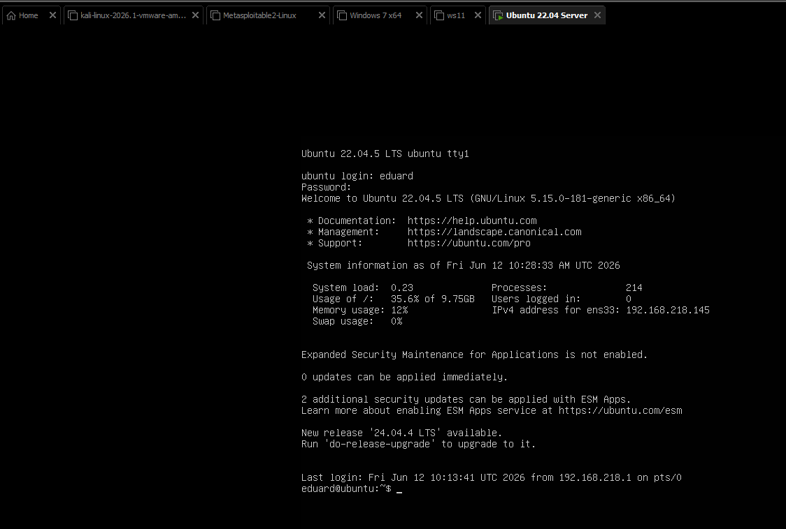

# Task 9

## Структура папок

- /app - тут лежит веб-приложение на ```Python FastAPI```
- /

## Ход выполнения работы

1. Реализовали веб-приложение на ```FastAPI``` с двумя эндпоинтами:

- I.	Возвращает "Hello, World!" при POST запросе с заголовком c ключом "Test" и значением "Hello", иначе возвращает 403.
- II.	/health при запросе пингует 77.88.8.8 и при успешном ответе возвращает статус 200 и текст "OK".

Код приложения находится в ```/app/main.py```.

2. Развернули Ubuntu Server 22.04 на VMWare Workstation


