# Task 9

## Структура папок

- /app - тут лежит веб-приложение на ```Python FastAPI```
- /

## Ход выполнения работы

## 1. Реализовали веб-приложение на ```FastAPI``` с двумя эндпоинтами:

- I.	Возвращает "Hello, World!" при POST запросе с заголовком c ключом "Test" и значением "Hello", иначе возвращает 403.
- II.	/health при запросе пингует 77.88.8.8 и при успешном ответе возвращает статус 200 и текст "OK".

Код приложения находится в ```/app/main.py```.

## 2. Развернули Ubuntu Server 22.04 на VMWare Workstation


## 3. Запустим python приложение как системный сервис:

- Создаем отдельного системного юзера

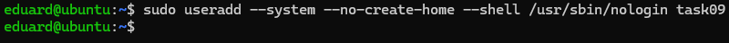

- Поменяем овнера, отдадим права пользователю task09

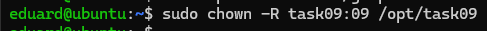

- Создаём venv и устанавливаем зависимости

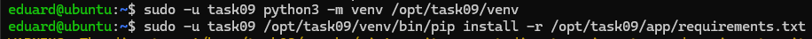

- Создали unit файл systemd, чтобы systemd перезапускал uvicorn как сервис, перезапускал его при падении и поднимал его после перезагрузки

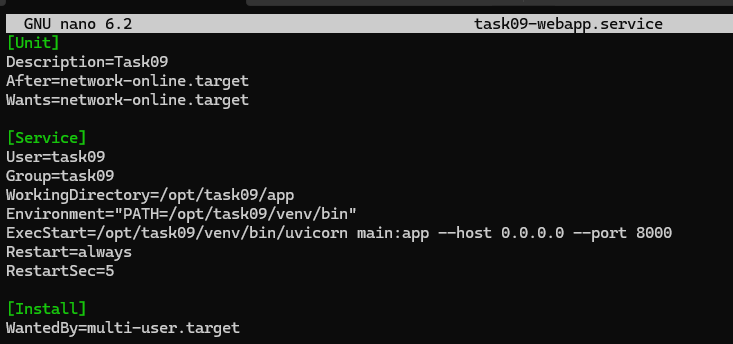

- Теперь ставим сервис в систему и запускаем

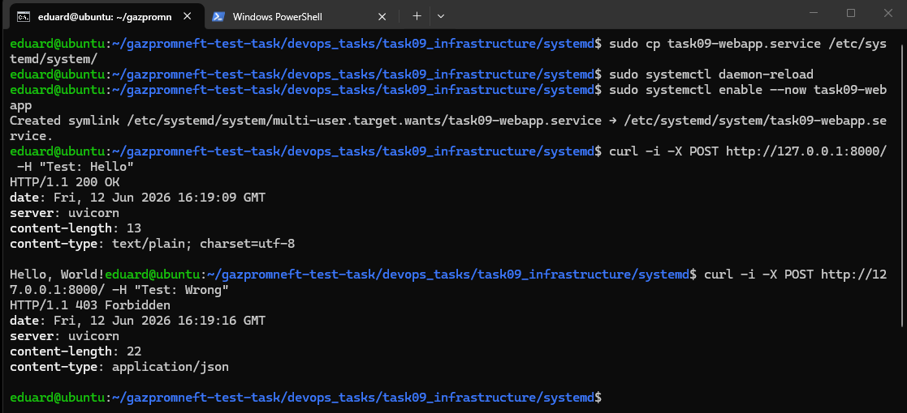

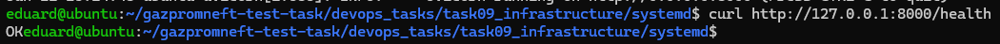

## 4. Dockerfile и сборка образа

- Написали Dockerfile

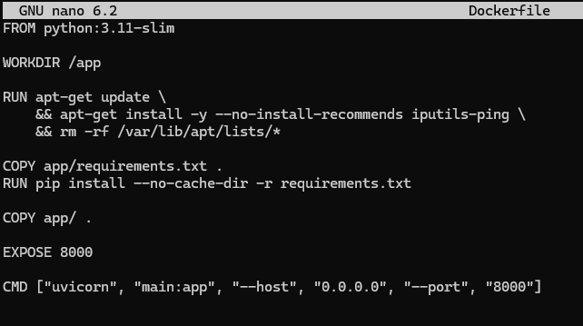

Здесь устанавливаем ping, очищаем apt кэш, устанавливаем зависимости из ```requirements.txt```

- Остановим сервис task09-webapp, чтобы он не занимал порт

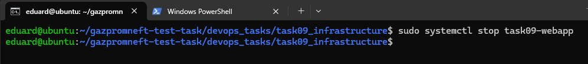

- Собираем образ

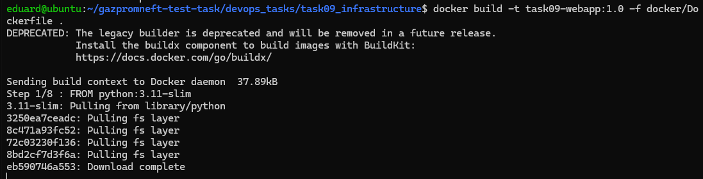

- Запустили контейнер

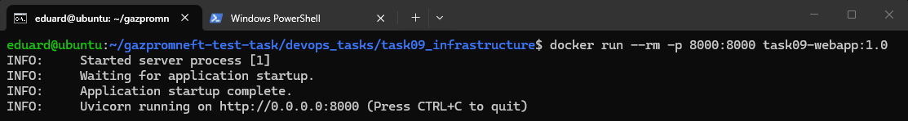

- Проверили работоспособность

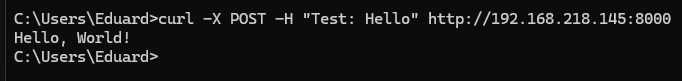

## 5. docker-compose файл с веб приложением, prometheus и alertmanager

- Сконфигурируем Blackbox exporter, который будет проверять доступность сервисов

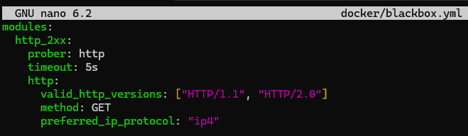

- Сконфигурируем prometheus и alertmanager

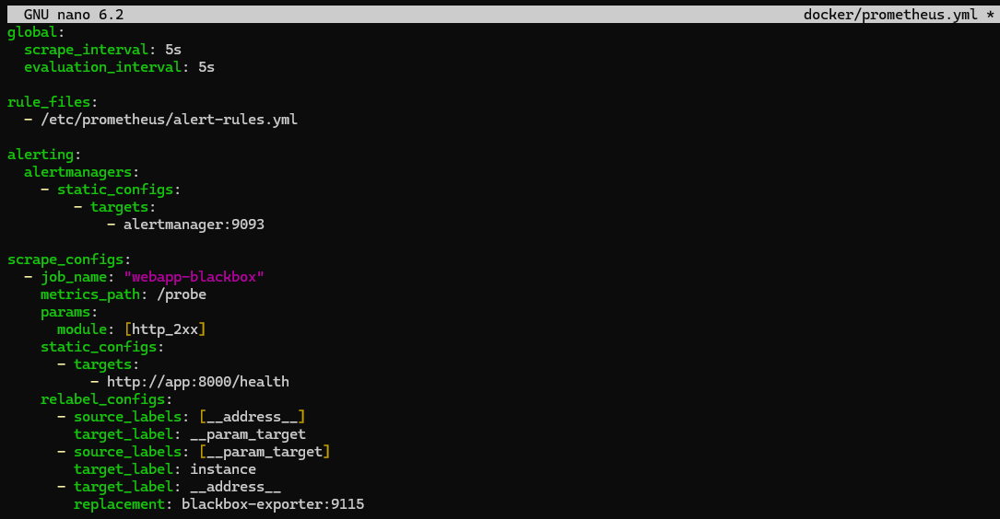

- Напишем alert-rules

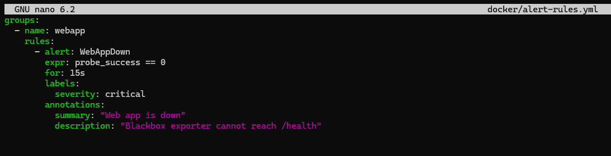

- Напишем alertmanager.yml

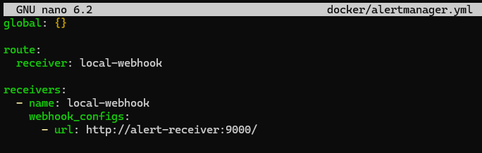

- Реализуем alert receiver на питоне и создадим requirements.txt для него

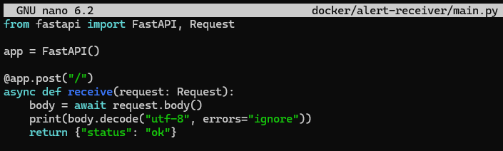

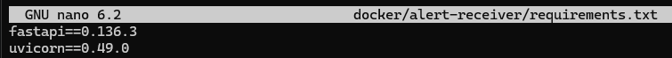

Это будет небольшой сервис, который просто принимает вебхук от алерт менеджера и печатает тело запроса в логи

- Также напишем докерфайл для алерт ресивера

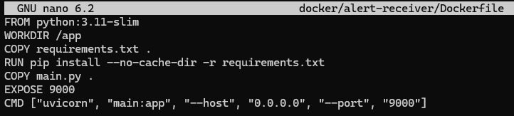

- Файл ```docker-compose.yml```, который будет отвечать за сборку всех образов: ```task09-app``` (само главное веб-приложение), ```backbox-exporter```, ```prometheus```,  ```alertmanager``` и ```alert-receiver```.

```docker
services:
  app:
    build:
      context: ..
      dockerfile: docker/Dockerfile
    container_name: task09-app
    ports:
      - "8000:8000"
    restart: unless-stopped

  blackbox-exporter:
    image: prom/blackbox-exporter:latest
    container_name: task09-blackbox
    volumes:
      - ./blackbox.yml:/etc/blackbox_exporter/config.yml:ro
    command:
      - --config.file=/etc/blackbox_exporter/config.yml
    ports:
      - "9115:9115"
    restart: unless-stopped

  prometheus:
    image: prom/prometheus:latest
    container_name: task09-prometheus
    volumes:
      - ./prometheus.yml:/etc/prometheus/prometheus.yml:ro
      - ./alert-rules.yml:/etc/prometheus/alert-rules.yml:ro
    command:
      - --config.file=/etc/prometheus/prometheus.yml
      - --storage.tsdb.path=/prometheus
    ports:
      - "9090:9090"
    restart: unless-stopped

  alertmanager:
    image: prom/alertmanager:latest
    container_name: task09-alertmanager
    volumes:
      - ./alertmanager.yml:/etc/alertmanager/alertmanager.yml:ro
    command:
      - --config.file=/etc/alertmanager/alertmanager.yml
    ports:
      - "9093:9093"
    restart: unless-stopped

  alert-receiver:
    build:
      context: ./alert-receiver
    container_name: task09-alert-receiver
    ports:
      - "9000:9000"
    restart: unless-stopped
```

- Теперь для запуска перейдём в каталог ```docker``` и запустим ```docker compose up -d --build```.

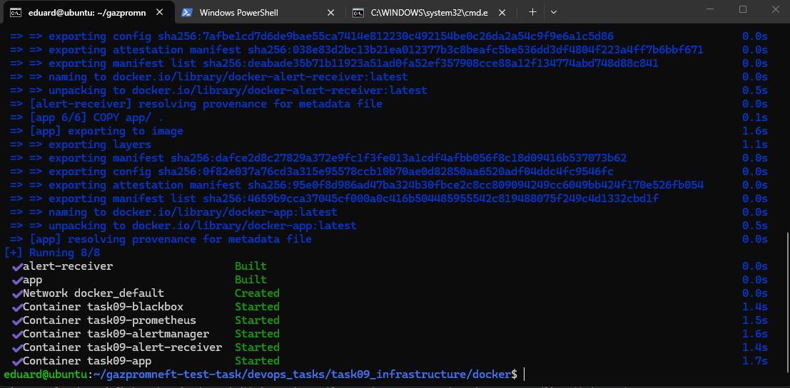

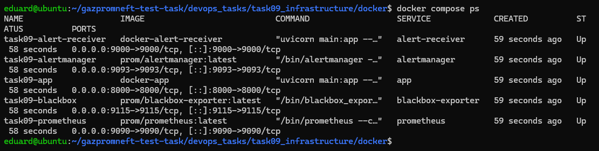

- Проверим наши мониторинги

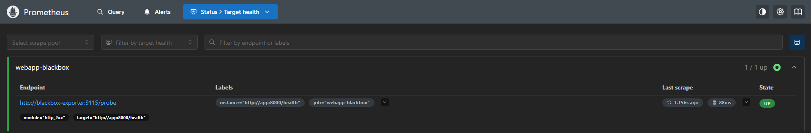

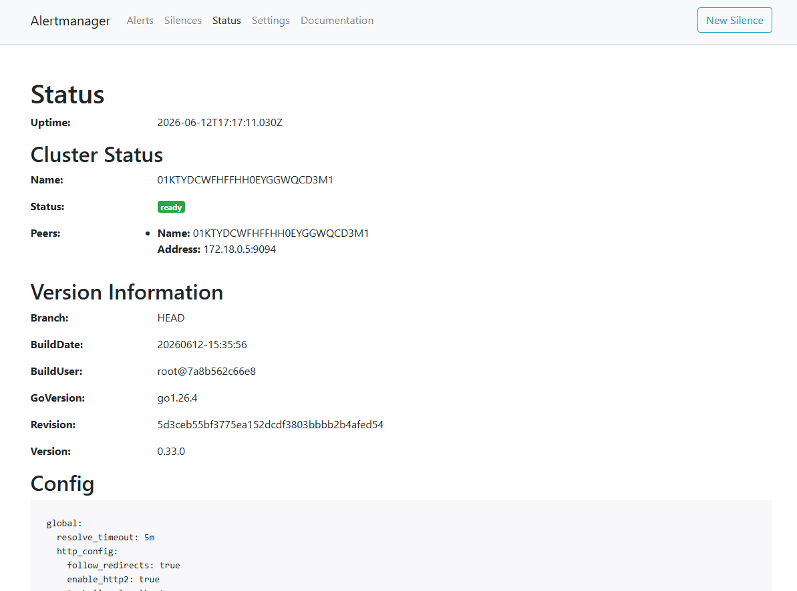

- Теперь для теста сделаем ```docker stop task09-app```, таким образом мы убьём наше веб-приложение и должен алерт менеджер поймать алерт, а prometheus сделать алерт WebAppDown

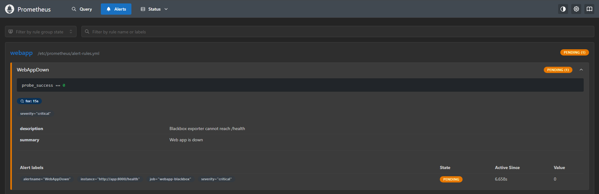

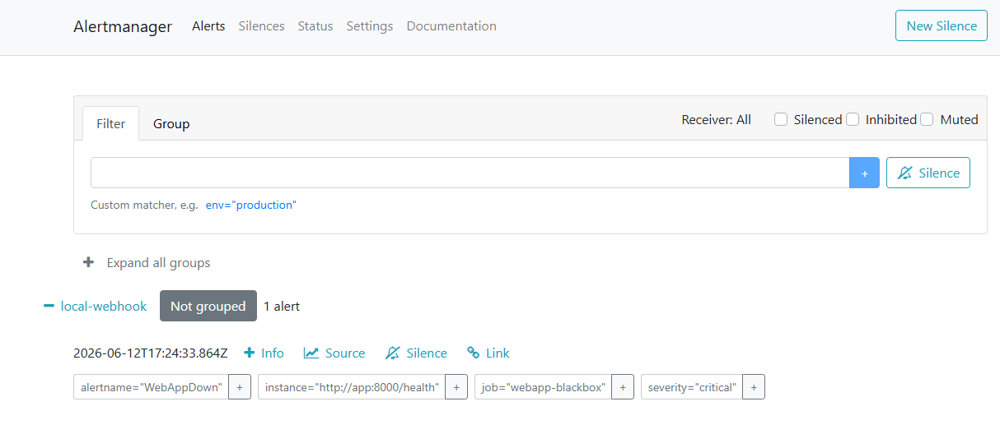

- Посмотрим также и JSON в логах ```alert-receiver```

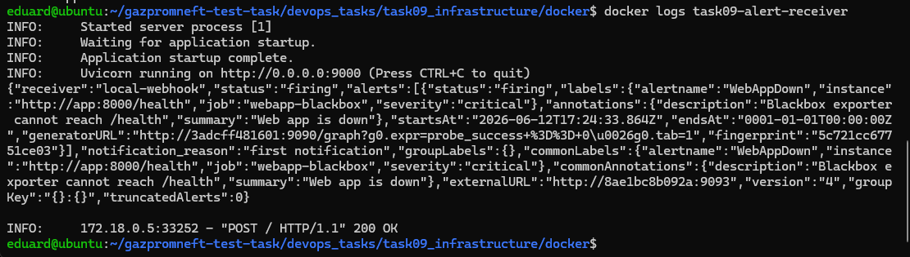

## 6. NAT

- Теперь нужно сделать вторую ВМ NAT шлюзом. Для этого сначала зададим на первой виртуальной машине два сетевых адаптера: один ```NAT```, второй зададим как внутренний ```net10```.

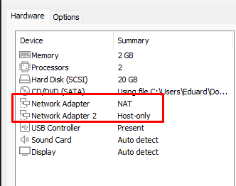

- На второй машине установим только один адаптер и сделаем его ```net10``` - внутренняя сеть.

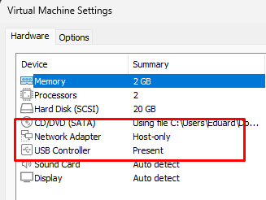

- Теперь необходимо назначить IP-адреса. Начнём с VM1 (которая имеет доступ в интернет). Для этого настроим netplan и назначим конкретный IP-адрес машине.

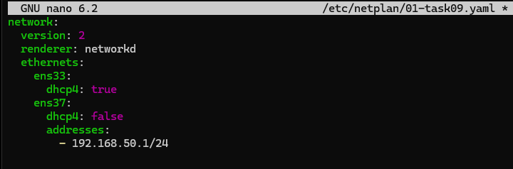

- Далее выполним ```sudo netplan apply```, чтобы применить конфигурацию. Также по дефолту линукс не пересылает данные между двумя интерфейсами, так что нужно это настроить:

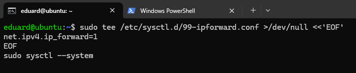

- Теперь надо добавить правила NAT на машине, то есть сказать системе, что всё, что идёт наружу из внутренней сети, мы должны маскировать внешним адресом машины

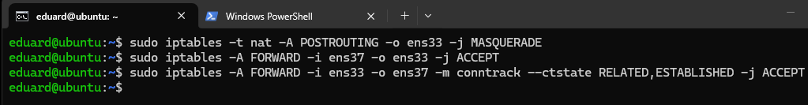

- Теперь надо сохранить эти правила после перезагрузки:

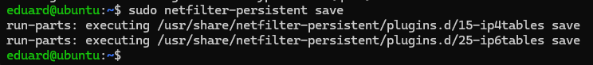

- Перейдём ко второй виртуалке, настроим netplan, пропишем также и dns, чтобы резолвились домены. В нетплане мы говорим, что прокидываем по дефолту весь внешний трафик к default gateway, которым выступает наша первая виртуалка.

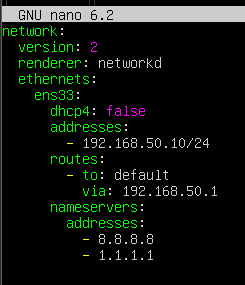

- Сразу пинганём первую VM:

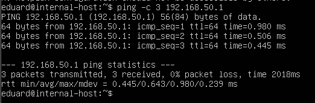

Успешно!

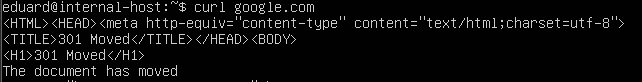

Работает также и доступ ко внешним серверам.

Теперь, к тому же, я могу подключиться по ssh к internal-хосту, пробрасывая трафик через шлюз:

```ssh -J eduard@192.168.218.145 eduard@192.168.50.10```

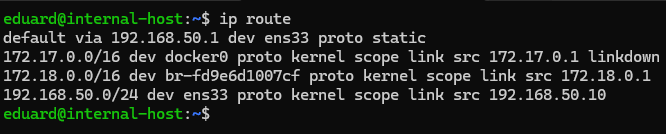

Как мы можем заметить, трафик прокидывается на internal-хосте через нашу первую VM - она и является нашей default-gateway.

## 7. Kubernetes

- Нужно выключить swap, потому что kubernetes требует, чтобы он был отключен, иначе могут работать некорректно. Для этого на каждой виртуалке выполним ```sudo swapoff -a```.

- Теперь нужно поставить все кубернетис-компоненты и runtime, для этого надо установить на всех виртуалках ```container runtime```, ```kubelet```, ```kubeadm```, ```kubectl```

(P.S: скриншоты прикладываются только с одной виртуалки, но выполняется действие на всех)

Установка пакетов:

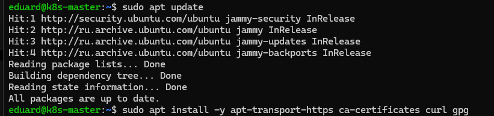

kernel modules:

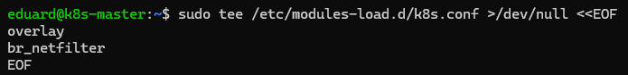

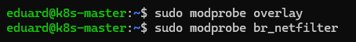

- Теперь ```sysctl```

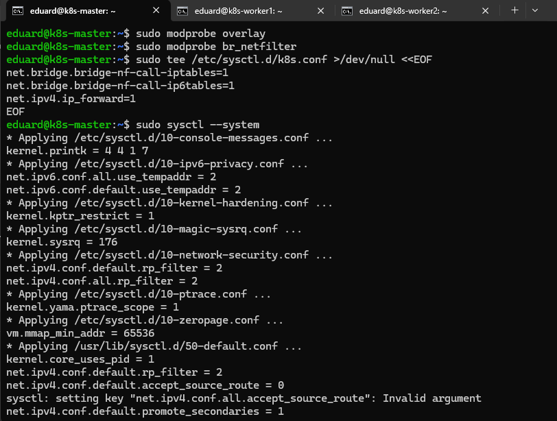

- Конфигурация ```containerd```

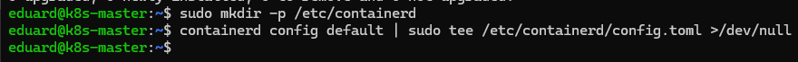

- Теперь нужно включить systemd cgroup:

В файле ```/etc/containerd/config.toml``` необходимо поменять ```SystemdCgroup = false``` на ```true```.

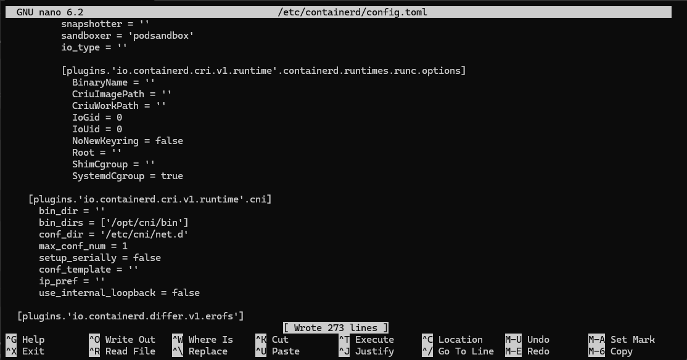

После этого:

```bash
sudo systemctl restart containerd
sudo systemctl enable containerd
```

- Установка kubeadm

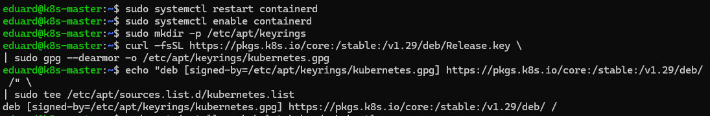

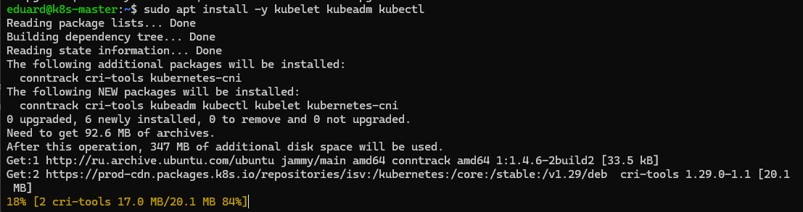

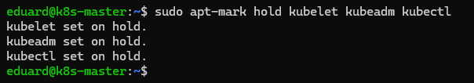

- Общие манипуляции для всех машин на этом заканчиваются, теперь нужно на мастере сделать ```kubeadm init``` и сконфигурировать kubectl и CNI (Flannel) и получить join команду

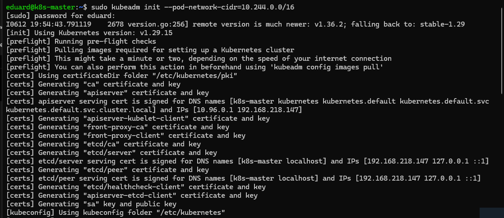

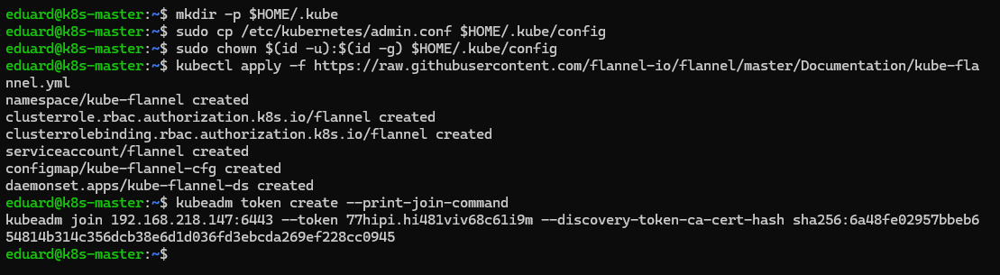

- Теперь на воркерах нужно вставить команду ```kubeadm join``` с токеном, который мы только что получили с мастера

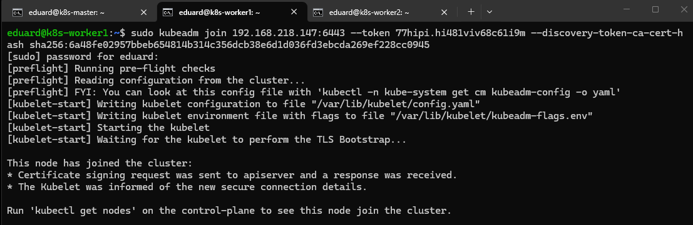

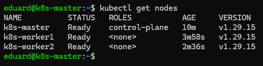

Как мы видим, ноды имеют STATUS = READY, значит всё супер.

- Теперь нужно развернуть Ingress-контроллер

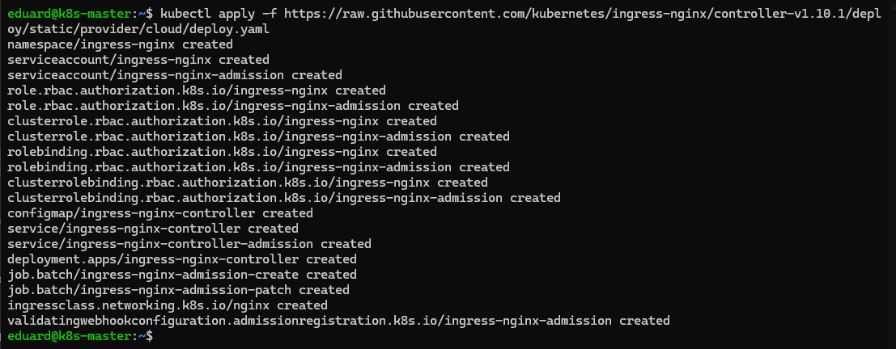

- Теперь мы можем запушить наш image в docker hub, чтобы затем с помощью Kubernetes уже развернуть контейнер на worker-нодах

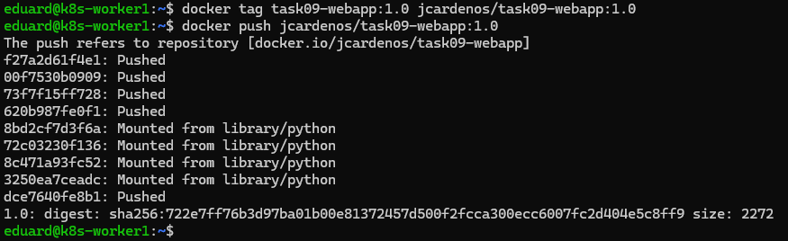

- Создаём deployment.yaml


- Создаём service.yaml


- Создаем ingress.yaml


- Деплоим


- Смотрим поды, они запустились


Как мы видим, куб распределил по одному поду на ноду.

- Проведём несколько тестов на нашем приложении, убедимся, что всё работает хорошо. Сходим в /health:


- Проверим ingress

